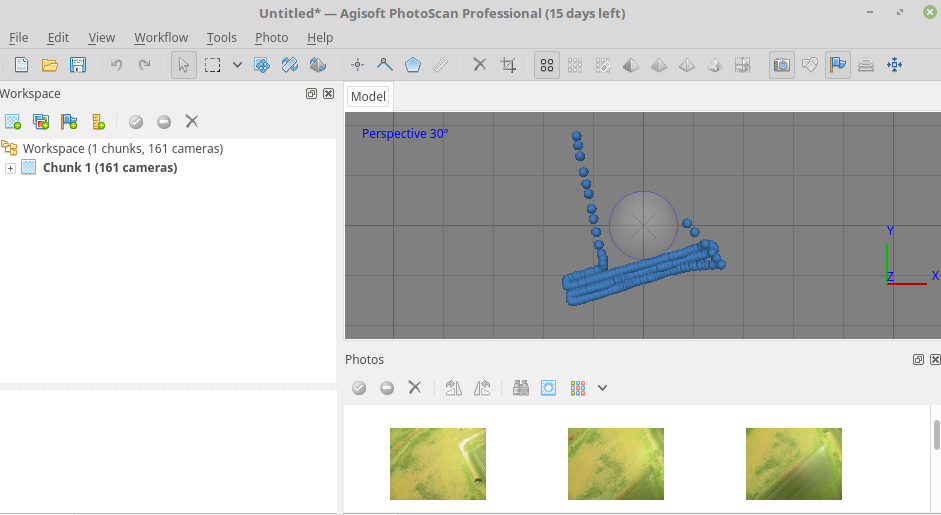
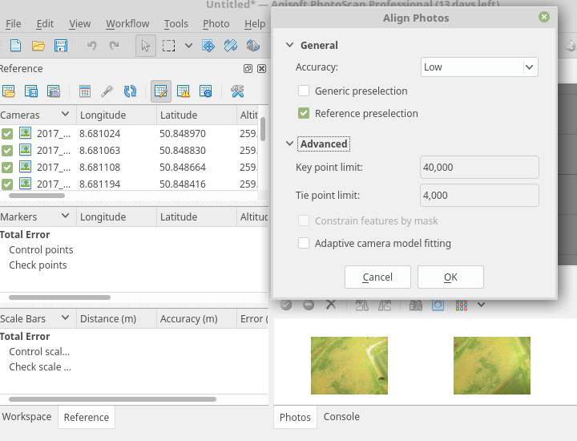
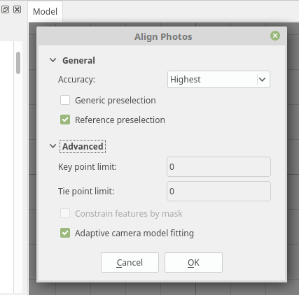
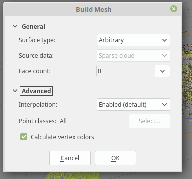

#   Agisoft Photoscan basic workflow

Even if both criteria not open source not free software, are missing one have to admit that 
Agisoft's Photoscan is a great tool for deriving point clouds and all kind of surface models from plain RGB imagery. It comes along with an incredible straightforward GUI and in Question of hardware requests and cost eff ency it is well balanced. For a deeper insight one should know how to deal with a lot o settings. We will cover this on a more specialized article [Photoscan and UAV Imagery](rs/micrors/agisoft/media/photoscanunderthehood). Let's start to follow the white rabbit.

### Add the photos to Photoscan

After loading the images into [Agisofts Photoscan](http://www.agisoft.com/) the aerial images are lining up along the flight track as you can see below.

### Alignment

`<note important>`Note: The quality of the alignment is crucial for **all** follow up products - especially 3D dense point cloud models and the cration of the orthoimage`</note>`

The **Align Images** process is somehow exploitative. For a quick start it is a good practice to use the following settings:

It will give you an good estimate how the general alignment process performs. 

`<note important>`Note: we did choose **reference preselection** due to the georeferenced images`</note>`

However there are a lot of different requirements depending on sensor, light and surface characteristics. For high quality images there is obviously [no](http://www.agisoft.com/forum/index.php?topic=3559.0)[ significant](http://www.agisoft.com/forum/index.php?topic=3559.0) quality improvement if increasing the number of keypoints behind 240000. You may calculate as a rule of thumb (same post) the maximum number of keypoint according to *megapixels x 6400*. 

For the Mapir or DJI this will results in roughly 77000 keypoints.  Nevertheless setting the params to zero will be interpreted as maximum which seems to be reliable if one is filtering the point clouds and 3D models in a second step.  So a reasonable highest quality approach may look like:

`<note tip>`Please keep in mind that it will take a really long time to align the images in a high quality process`</note>`

`<note important>`Please keep also in mind that if you have a poor image quality and/or alignment you will mess up your tie point cloud with a lot of spurious tie points if you use the maximum setting. It happens sometimes that you wont' be able  to get rid of these points later on.`</note>`

### Creating high quality sparse (tie) point clouds

The trick to derive a high quality sparse  point clouds is to avoid spurious information and to retrieve a good spatial positioning of the images. In other words you need a optimal alignment with as less as possible “spurious” tie points.  You can reach itin most cases with a highest quality alignment and posterior filtering and camera optimization  process. If still the result is not satisfying your needs,  you additionally may also use ground control points GCPs. 

We made fairly good experiences following [jhutan](http://www.agisoft.com/forum/index.php?action=profile;u=179074) who suggest the this [workflow](http://www.agisoft.com/forum/index.php?topic=3559.0) for generating high quality point clouds. Usually we need only one recursion of gradual selection:

 1.  Remove sparse points by gradual selection (see below)
 2.  Optimize cameras (after** each** removal)
 3.  Optionally repeat steps 1-2 until the reconstruction error is minimized

Ad 1: this removes spurious points from the point cloud e.g. it will smooth the surface

Ad 2: all cameras will be re-optimized for the new geometry

#### Gradual Selection Process

Before starting the gradual selection process right-click your current chunk in the Workspace window and select “Duplicate chunk”, then proceed with the copy. 

 1.  Choose “Reconstruction uncertainty“. Type something like “10” and see the as a result all points in the sparse cloud selected Clicking “OK” and “DEL” will delete the selected points. If the DEL key doesn’t work, you need to click once into the model window to activate it, and press DEL again.
 2.  Next choose the “Reprojection Error” option. Set it to < 1 and again delete the selected points then click that wizard’s wand icon again. 
 3.  Finally check the “Projection Accuracy”  try to delete the poorest 10 % of the points
For more details have a look at e.g.  [dinosaurpaleo](https///dinosaurpalaeo.wordpress.com/2015/10/11/photogrammetry-tutorial-11-how-to-handle-a-project-in-agisoft-photoscan/).  

`<note tip>`It is recommended to keep in line with this process if you want to reconstruct high quality point clouds and surfaces like textures or orthoimages. Even if it seems to be an annoying manual approach, you will soon notice that the time you have spent pays itself several times…\\ For a first automatic retrieval you may use the script *makeSparseCloud.py*`</note>`

### Build 3D model (mesh)

Now you may use the derived sparse point cloud to build a 3D model. the process is straightforward. For an maximum number of faces in the mesh choose the following settings:

### Generate Orthophoto

Creating an orthoimage is a very straightforward approach and it differs slightly from deriving a high density point cloud. Just follow the below outlined Workflow. 

 1.  load the prepared images
 2.  check image quality 
 3.  align images according as proposed before
 4.  build mesh on an optimized sparse point cloud
 5.  create orthoimage on the mesh

Using a mesh (3D model) will give in most cases better results for the orthoimage generation of  low AGL flight level altitude imagery. Nevertheless you have to check what kind of cloud is more sufficient the dense or sparse point cloud. It depends on the structure. You will get often more satisfactory results using a well preprocessed sparse point cloud.  

So the recommended settings are:

Et voila - Finally you derive an orthoimage of fairly high quality 

### Creating high quality dense point clouds

Hence micro-remote sensing is usually restricted to a single (visible) layer the temporal scale this layer can be observed by drones is the advantage compared to high-cost and temporal limited LIDAR data sets. Using photoscan the dense point cloud might still be classified in different layers depending of the structure of the observed area and structure (i.e a deciduous forest can be observed in winter for ground models and tree structure while summer flights will deliver good surface models). 

Additionally dense clouds can be exported in several formats to be used in further processing in QGIS, SAGa or 3D modelbuilder software. So it is easy to benefit from already existing and established workflows which were developed for LIDAR oder 3D modeling data. 

The settings of the dense point cloud calculation determines quality and necessary calculation time. Hereby a higher quality results in longer calculation time. Aggressive filtering ignores small structures and runs fastest while moderate and mild filtering consider smaller structures on the cost of longer calculation time.

The dense point cloud can be calculated as soon the pictures are aligned. Even if the dense cloud comes second in the workflow dropdown menu in Photoscan it should be considered to calculate the orthoimage first as the dense point cloud will take the longest time of all processes. 

### Photoscan import/export

